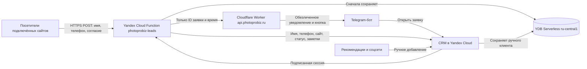
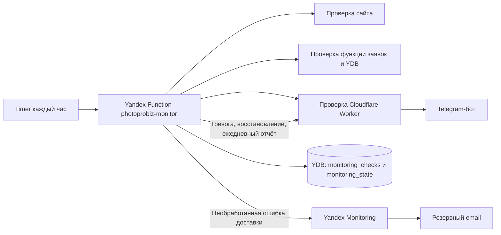

# Текущее состояние photoprobiz.ru

Последнее обновление: 11 сентября 2026 года. Это оперативная карта действующего сайта. После изменения инфраструктуры обновляйте этот файл вместе с профильной инструкцией и `AGENTS.md`.

## Статус системы

| Компонент | Состояние | Где работает |
| --- | --- | --- |
| Публичный сайт | Работает, HTTP 200 | GitHub Pages + `photoprobiz.ru` |
| Формы заявок | Работают | Браузер → Yandex Cloud Function |
| Хранение заявок | Работает | YDB Serverless, `ru-central1` |
| CRM-кабинет | Работает | Yandex Cloud Function, вход по паролю, сайты, ручные клиенты и заметки |
| Telegram-уведомления | Работают | Yandex → Cloudflare Worker → Telegram |
| Мониторинг | Работает каждый час | Yandex Cloud Function + timer trigger |
| История мониторинга | Работает | Таблицы YDB с TTL 180 дней |
| Резервное оповещение | Настроено | Yandex Monitoring → email владельца |
| Публикация | Автоматическая | Push в `main` → GitHub Actions → Pages |

Последняя ручная проверка 11 сентября 2026 года: функция и Worker отвечали HTTP 200; авторизованный CRM API загрузил сайты, существующие заявки и заметки. Последний документирующий коммит перед этим снимком: `93d03da`.

## Архитектура заявок



Персональные данные идут из браузера прямо в Yandex Cloud и первично записываются в российскую YDB. Cloudflare и Telegram получают только случайный идентификатор заявки, имя сайта и служебное время. Кнопка Telegram открывает защищённый кабинет; имя и телефон загружаются напрямую из Yandex Cloud после авторизации.

## Архитектура мониторинга



Проверка запускается каждый час. Инцидент открывается после трёх последовательных ошибок. После восстановления отправляется отдельное сообщение. При исправной системе в 10:00 по Москве приходит ежедневное сообщение. История хранится 180 дней.

Резервный email предназначен для сбоя основного пути уведомления. Если сайт недоступен, но сообщение об этом успешно пришло в Telegram, резервный email не дублирует его. Если функция не смогла доставить уведомление через Cloudflare/Telegram и завершилась ошибкой, срабатывает Yandex Monitoring.

## Действующие ресурсы

### GitHub и сайт

- Репозиторий: `https://github.com/kuznetsovphotographer-prog/photoprobiz`
- Основная ветка: `main`
- Workflow: `.github/workflows/deploy-pages.yml`
- Публичный сайт: `https://photoprobiz.ru/`
- Публикация выполняется GitHub Pages после успешных тестов и сборки.

### Yandex Cloud: заявки и кабинет

- Каталог: `default`, ID `b1glondcnskhinn14pk3`
- Функция: `photoprobiz-leads`
- ID функции: `d4e5ur2fo156lrcve6id`
- Проверенный URL: `https://functions.yandexcloud.net/d4e5ur2fo156lrcve6id`
- Кабинет: `https://functions.yandexcloud.net/d4e5ur2fo156lrcve6id?admin=1`
- Активная CRM-версия: `d4emhherai50mbk4si70`
- Runtime: Node.js 22, точка входа `index.handler`, 256 МБ, таймаут 15 секунд.
- Сервисный аккаунт: `photoprobiz-leads-sa`

### Yandex Database

- База: `photoprobiz-leads-db`
- Тип: Serverless OLTP
- Регион: `ru-central1`
- ID: `etnj5v1s6iavjmndcs7o`
- Путь: `/ru-central1/b1g3rq4isb0l45hg2kg0/etnj5v1s6iavjmndcs7o`
- Endpoint: `grpcs://ydb.serverless.yandexcloud.net:2135`
- Роль сервисного аккаунта на базе: `ydb.editor`
- Таблицы заявок: `leads`, `consent_events`, `lead_meta`
- Таблицы мониторинга: `monitoring_checks`, `monitoring_state`
- TTL: заявки и CRM-заметки 1 год, доказательства согласия 3 года, проверки мониторинга 180 дней.

### Cloudflare и Telegram

- Worker: `photoprobiz-lead-form`
- Домен Worker: `https://api.photoprobiz.ru`
- Health: `https://api.photoprobiz.ru/health`
- Защищённые маршруты: `POST /lead` для обезличенных уведомлений о заявках, `POST /monitor` для служебных сообщений мониторинга.
- Несекретная переменная Worker: `ADMIN_BASE_URL`.
- Секреты Worker: `TELEGRAM_BOT_TOKEN`, `TELEGRAM_CHAT_ID`, `RELAY_TOKEN`.

### Yandex Cloud: мониторинг

- Функция: `photoprobiz-monitor`
- ID функции: `d4e58jcg3sjqbl1hc3ak`
- Активная версия: `d4e75ln7cf6au7dptabi`
- Timer trigger: `photoprobiz-hourly-monitor`, ID `a1sroguru0c3afpll9v3`
- Cron: `0 * ? * * *` по UTC, три повторные попытки с интервалом 60 секунд.
- Email-канал: `photoprobiz-monitor-reserve`, ID `fbe4m45u0ai126c8ie6s`
- Алерт: `photoprobiz-monitor-reserve-alert`, ID `monsihgbrbl0klc9l2ml`
- Метрика алерта: `functions_errors` функции `photoprobiz-monitor`.
- Пороги: `Warning > 0`, `Alarm > 0,5`; окно 5 минут, задержка 30 секунд.
- Уведомления: `Warning`, `Alarm`, `Error`, `Ok`; `No data` отключено.

## API вместо GraphQL

GraphQL и GraphiQL в проекте не используются. Они здесь не нужны: у сайта небольшой закрытый набор операций, реализованный через обычные HTTPS-запросы.

| Метод и адрес | Назначение |
| --- | --- |
| `POST` на URL функции заявок | Валидация, запись заявки и согласия, запуск уведомления |
| `GET` URL функции заявок | Health функции, YDB и кабинета |
| `GET ?admin=1` | Оболочка личного кабинета |
| Закрытые `admin_api` запросы | Вход, сайты, список, карточка, статус, заметки и ручное создание клиента |
| `GET https://api.photoprobiz.ru/health` | Health Worker, Telegram, relay и ссылки кабинета |
| `POST https://api.photoprobiz.ru/lead` | Обезличенное Telegram-уведомление о заявке |
| `POST https://api.photoprobiz.ru/monitor` | Служебное сообщение мониторинга |

## Авторизация кабинета

CRM использует пароль и подписанный токен в `localStorage` origin Yandex Functions. Сессия скользящая: каждый успешный запрос продлевает её ещё на 90 дней. Повторный вход нужен после 90 дней бездействия, ручного выхода, очистки данных браузера или смены `ADMIN_SESSION_SECRET`.

CRM умеет показывать один сайт или все сайты, создавать клиента вручную, хранить источник и заметку, звонить и открывать WhatsApp/Telegram. Для MAX номер копируется, затем открывается веб-версия: публичной прямой ссылки поиска пользователя по номеру у MAX нет. Сейчас подключён `photoprobiz.ru`; ручные записи имеют служебный источник `manual.crm`. Новые сайты добавляются через `CRM_SITES_JSON` в функции и совместимый POST формы.

Ручная запись не создаёт фиктивное событие согласия сайта в `consent_events`. Перед внесением контакта владелец отвечает за подходящее правовое основание и соблюдение опубликованных документов и внутренних процедур.

Переменные функции: `ADMIN_BASE_URL`, `ADMIN_PASSWORD_SCRYPT`, `ADMIN_SESSION_SECRET`. Их значения нельзя помещать в Git, ZIP, Markdown, сообщения или скриншоты.

## Где лежат секреты

В репозитории секретов быть не должно. Допустимы только имена переменных и несекретные идентификаторы ресурсов.

- Локальные данные кабинета: `%LOCALAPPDATA%\photoprobiz\admin-cabinet-credentials.txt`
- Локальный общий relay-секрет: `%LOCALAPPDATA%\photoprobiz\yandex-relay-token.txt`
- Локальный токен управления Cloudflare: `%LOCALAPPDATA%\photoprobiz\cloudflare-api-token.txt`
- Рабочие значения функции находятся в переменных версии Yandex Cloud Function.
- Telegram-токен, chat ID и relay-токен находятся в Cloudflare Worker Secrets.

Если какой-либо секрет был показан постороннему человеку, попал в лог, скриншот или репозиторий, его нужно перевыпустить в соответствующем сервисе и проверить тестовую доставку.

## Критические правила изменений

1. Не отправляйте имя, телефон, способ связи, пакет или сведения о согласии в Cloudflare и Telegram.
2. Сначала записывайте заявку и событие согласия в YDB, только затем отправляйте обезличенное уведомление.
3. Не ослабляйте обязательную пустую галочку согласия и блокировку отправки без неё.
4. При изменении состава данных, сроков или инфраструктуры одновременно обновляйте `src/data/privacy.ts`, публичные страницы и документацию.
5. Не коммитьте `.env*`, `output/`, `dist/`, `node_modules/`, локальные токены и ZIP с рабочими настройками.
6. Не заменяйте личные фотографии стоковыми и не придумывайте факты об услугах.
7. Публикацию считайте завершённой после успешного GitHub Actions и проверки реального домена.

## Проверки перед публикацией

```powershell
npm.cmd ci
npm.cmd run check
npm.cmd test
node --test yandex/lead-function/*.test.cjs
node --test yandex/monitor-function/*.test.cjs
npm.cmd run build
```

Push в `main` запускает `.github/workflows/deploy-pages.yml`. После завершения нужно проверить GitHub Actions, `https://photoprobiz.ru/`, URL функции заявок, `/health` Worker и тестовую заявку. Не используйте реальные данные клиента для теста.

Cloudflare Worker проверяется отдельно:

```powershell
cd cloudflare/lead-worker
npm.cmd ci
npm.cmd run check
npm.cmd run deploy:dry
```

## Быстрая диагностика

| Симптом | Что проверить сначала |
| --- | --- |
| Сайт не открывается | Последний GitHub Actions, настройки Pages, DNS и HTTPS домена |
| Форма зависает или выдаёт ошибку | GET health функции заявок, логи её активной версии, доступность YDB |
| Заявка есть в YDB, но Telegram молчит | `/health` Worker, его логи и наличие трёх Worker Secrets |
| Кнопка «Открыть заявку» ведёт не туда | `ADMIN_BASE_URL` в `cloudflare/lead-worker/wrangler.jsonc` |
| Кабинет не принимает пароль | `ADMIN_PASSWORD_SCRYPT`, `ADMIN_SESSION_SECRET`, активная версия функции |
| Монитор не запускается | Статус timer trigger и права сервисного аккаунта на вызов функции |
| Нет резервного email | Метрика `functions_errors`, привязка канала к алерту и выбранные статусы уведомлений |

Логи и сообщения об ошибках не должны содержать персональные данные или значения секретов.

## Карта документации

- `AGENTS.md` — обязательный стартовый контекст и правила для следующего AI-агента.
- `README.md` — структура фронтенда, локальный запуск и редактирование сайта.
- `UNIVERSAL-RUSSIA-LEADS-DEPLOYMENT.md` — универсальная полная схема для другого сайта.
- `YANDEX-CLOUD-YDB-PERSONAL-DATA-GUIDE.md` — YDB, согласия, сроки хранения и функция заявок.
- `YANDEX-CLOUDFLARE-TELEGRAM-GUIDE.md` — создание и развёртывание связки Yandex, Cloudflare и Telegram.
- `yandex/lead-function/README.md` — эксплуатация функции заявок и кабинета.
- `yandex/monitor-function/README.md` — эксплуатация функции мониторинга.
- `cloudflare/lead-worker/README.md` — Worker, секреты и деплой.
- `GITHUB-PAGES-PUBLISH.md` — GitHub Pages и пользовательский домен.
- `RUSSIA-NO-VPN-DEPLOYMENT.md` — причины российской точки входа и проверка без VPN.

## Что ещё находится вне кода

### Сверка документов 12.09.2026

Политика и согласие бизнес-сайта обновлены до `2026-09-12`; техническая сверка и оставшиеся риски описаны в `PERSONAL-DATA-REVIEW-2026-09-12.md`. Бизнес-форма не собирает устройство/ОС; кабинет показывает эти поля для интерьерного источника. Схема YDB не менялась. Сроки документов согласованы с кодом: год для заявки и заметок, три года как предельный срок доказательства от серверного получения, с обязанностью оценивать законное основание и досрочное удаление.

12.09.2026 в Yandex активирована версия `d4epvjgnddsorqdkdbav`: одна строка допустимых версий согласия изменена на `['2026-09-11', '2026-09-12']` поверх действующей `d4ep920gau2qjt00ikor`. Остальные исходники, базы и секреты при этом не заменялись. Архив старого текста — `docs/legal/privacy-and-consent-2026-09-11.ts.txt`.

Термин «обезличенное» в старых архитектурных описаниях означает минимальное уведомление без контактов, а не подтверждённый юридический статус: ID связан с клиентом. После нажатия кнопок WhatsApp/Telegram номер передаётся выбранному мессенджеру. Статус уведомлений РКН и законность иностранной части схемы отдельно не подтверждены.

Техническая инфраструктура настроена, но юридические действия владельца не выполняются автоматически кодом. Владелец отдельно проверяет необходимость и статус уведомления Роскомнадзора, актуальность опубликованных документов, домена, платёжного аккаунта и контактных данных оператора. При юридически значимых изменениях нужна проверка специалиста по российскому законодательству.
